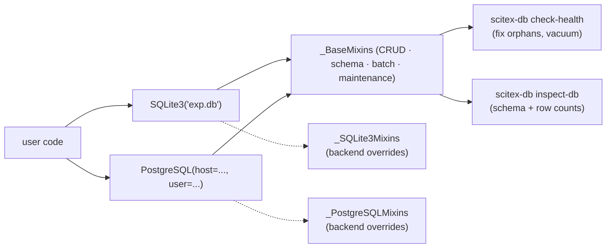

# scitex-db

<p align="center">
  <a href="https://scitex.ai">
    
  </a>
</p>

<p align="center"><b>Database utilities for scientific computing — SQLite3 + PostgreSQL with NumPy-aware storage.</b></p>

<p align="center">
  <a href="https://scitex-db.readthedocs.io/">Full Documentation</a> · <code>pip install scitex-db</code>
</p>

<!-- scitex-badges:start -->
<p align="center">
  <a href="https://pypi.org/project/scitex-db/"></a>
  <a href="https://pypi.org/project/scitex-db/"></a>
  <a href="https://github.com/ywatanabe1989/scitex-db/actions/workflows/test.yml"></a>
  <a href="https://codecov.io/gh/ywatanabe1989/scitex-db"></a>
  <a href="https://scitex-db.readthedocs.io/en/latest/"></a>
  <a href="https://www.gnu.org/licenses/agpl-3.0"></a>
</p>
<!-- scitex-badges:end -->

---

## Problem and Solution

| # | Problem | Solution |
|---|---------|----------|
| 1 | **Storing ndarrays in SQLite means `pickle.dumps → BLOB`** — no compression, no dtype/shape, no deterministic hashing | **`db.save_array(table, arr) / load_array(...)`** — typed compressed BLOBs round-trip with `dtype`, `shape`, `is_compressed`, `_hash` columns |
| 2 | **`sqlite3` API is low-level** — every project re-writes connect / transaction / execute boilerplate | **`with db.transaction(): ...`** — context-managed transactions, health checks, dedup, schema inspection built-in |
| 3 | **Switching SQLite ↔ Postgres rewrites every call site** | **Mixin composition** — `SQLite3` and `PostgreSQL` share `_BaseMixins/`; the same call site works against either backend |

## Installation

```bash
pip install scitex-db                 # SQLite3 only
pip install scitex-db[postgresql]     # add psycopg2 driver
pip install scitex-db[all]            # everything
```

### Configuration

Defaults work out of the box. To override, drop a `config.yaml` next to
your script, or point `SCITEX_DB_CONFIG` at one — see
[`.env.example`](./.env.example) for the full env-var list and
resolution order.

## Quick Start

```python
from scitex_db import SQLite3
import numpy as np

db = SQLite3("experiments.db")

db.create_table("results", {
    "id": "INTEGER PRIMARY KEY",
    "experiment": "TEXT",
    "accuracy": "REAL",
})
db.insert_many("results", [
    {"experiment": "exp1", "accuracy": 0.95},
    {"experiment": "exp2", "accuracy": 0.92},
])

# NumPy arrays round-trip with dtype/shape preserved
db.save_array("features", np.random.rand(1000, 50), column="embeddings",
              additional_columns={"model": "bert"})
features = db.load_array("features", "embeddings", where="model = 'bert'")
```

## 2 Interfaces

<details open>
<summary><strong>Python API ⭐⭐⭐</strong> &nbsp;<sub>primary surface</sub></summary>

<br>

```python
from scitex_db import SQLite3, PostgreSQL, check_health, inspect

# Backends
db = SQLite3("experiments.db")
db = PostgreSQL(host=..., user=..., dbname=...)

# CRUD
db.insert("results", {"experiment": "exp1", "accuracy": 0.95})
db.insert_many("results", rows, batch_size=1000)
rows = db.get_rows("results", where="accuracy > 0.9")
db.update("results", {"accuracy": 0.97}, where="id = 1")
db.delete("results", where="id = 1")

# Arrays / Blobs
db.save_array(table, arr, column="data")
db.load_array(table, "data", where=...)
db.save_blob(table, obj, column="checkpoint")
db.load_blob(table, "checkpoint", where=...)

# Transactions / maintenance
with db.transaction():
    db.insert("a", {...}); db.insert("b", {...})
db.summary                # schema + row counts
inspect("experiments.db") # standalone helper
check_health("experiments.db", fix_issues=True)
```

</details>

<details>
<summary><strong>CLI ⭐⭐</strong> &nbsp;<sub><code>scitex-db &lt;subcommand&gt;</code></sub></summary>

<br>

```bash
scitex-db --help-recursive            # all subcommands at once
scitex-db inspect-db experiments.db   # schema + row counts
scitex-db inspect-db experiments.db --tables results --json
scitex-db check-health experiments.db --fix --yes
scitex-db check-health experiments.db --dry-run
scitex-db list-python-apis            # introspect public Python surface
```

Every subcommand supports `-h/--help`, `--json`, and the safety pair
`--dry-run` / `--yes` where it mutates state.

</details>

## Architecture

```
scitex_db/
├── __init__.py            ← public API (SQLite3, PostgreSQL, check_health, inspect)
├── __main__.py            ← `scitex-db` CLI entry
├── _BaseMixins/           ← backend-agnostic mixins (CRUD, schema, batch, ...)
├── _sqlite3/              ← SQLite3 driver
│   └── _SQLite3Mixins/    ← SQLite3-specific mixin overrides
├── _postgresql/           ← PostgreSQL driver
│   └── _PostgreSQLMixins/ ← PostgreSQL-specific mixin overrides
├── _check_health.py       ← `scitex-db check-health`
├── _inspect.py            ← `scitex-db inspect-db`
├── _inspect_optimized.py  ← faster path for large DBs
├── _delete_duplicates.py  ← duplicate-row cleanup
├── _utils.py              ← shared helpers
└── _skills/               ← agent-facing skill files
```

Each backend composes its `_*Mixins/` folder onto `_BaseMixins/`, so
swapping `SQLite3` ↔ `PostgreSQL` does not change call sites.

## Demo



## Part of SciTeX

`scitex-db` is part of [**SciTeX**](https://scitex.ai). Install via the
umbrella with `pip install scitex[db]`, then import as `scitex.db` or
invoke `scitex db <subcommand>` — the standalone `scitex-db` package
remains the source of truth.

>Four Freedoms for Research
>
>0. The freedom to **run** your research anywhere — your machine, your terms.
>1. The freedom to **study** how every step works — from raw data to final manuscript.
>2. The freedom to **redistribute** your workflows, not just your papers.
>3. The freedom to **modify** any module and share improvements with the community.
>
>AGPL-3.0 — because we believe research infrastructure deserves the same freedoms as the software it runs on.

---

<p align="center">
  <a href="https://scitex.ai" target="_blank"></a>
</p>
