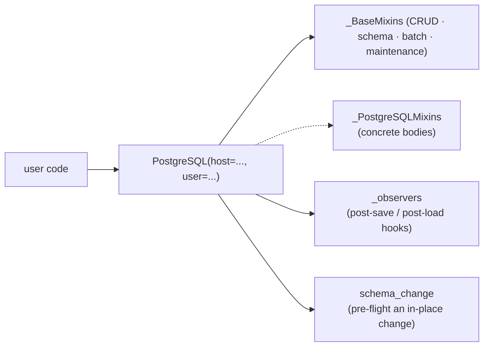

# scitex-db

<p align="center">
  <a href="https://scitex.ai">
    
  </a>
</p>

<p align="center"><b>PostgreSQL utilities for scientific computing — NumPy-aware storage.</b></p>

<p align="center">
  <a href="https://scitex-db.readthedocs.io/">Full Documentation</a> · <code>uv pip install scitex-db[all]</code>
</p>

<!-- scitex-badges:start -->
<p align="center">
  <a href="https://pypi.org/project/scitex-db/"></a>
  <a href="https://pypi.org/project/scitex-db/"></a>
  <a href="https://github.com/ywatanabe1989/scitex-db/actions/workflows/rtd-sphinx-build-on-ubuntu-latest.yml"></a>
</p>
<p align="center">
  <a href="https://github.com/ywatanabe1989/scitex-db/actions/workflows/pytest-matrix-on-ubuntu-py3-11-3-12-3-13.yml"></a>
  <a href="https://codecov.io/gh/ywatanabe1989/scitex-db"></a>
  <a href="https://www.gnu.org/licenses/agpl-3.0"></a>
</p>
<!-- scitex-badges:end -->

---

## Problem and Solution

| # | Problem | Solution |
|---|---------|----------|
| 1 | **Storing ndarrays in a table means `pickle.dumps → bytes`** — no dtype, no shape, nothing to reconstruct from | **`db.save_array(table, arr) / load_array(...)`** — `BYTEA` payloads round-trip through `<column>_dtype` / `<column>_shape` sidecar columns |
| 2 | **The `psycopg2` API is low-level** — every project re-writes connect / transaction / execute boilerplate | **`with db.transaction(): ...`** — context-managed transactions, batch insert, schema inspection built-in |
| 3 | **An in-place schema change on a live store is a guess** | **`scitex_db.schema_change`** — pre-flight the change, probe a physical artifact, and refuse on a zero the instrument did not earn |

## Installation

```bash
pip install scitex-db                 # library only
pip install scitex-db[postgresql]     # add the psycopg2 driver
pip install scitex-db[all]            # everything
```

### Configuration

Defaults work out of the box. To override, drop a `config.yaml` next to
your script, or point `SCITEX_DB_CONFIG` at one — see
[`.env.example`](./.env.example) for the full env-var list and
resolution order.

## Quick Start

```python
import os
import numpy as np
from scitex_db import PostgreSQL

db = PostgreSQL(
    dbname="lab", user="me", password=os.environ["PGPASSWORD"],
    host="localhost", port=55432,
)

db.create_table("results", {
    "id": "SERIAL PRIMARY KEY",
    "experiment": "TEXT",
    "accuracy": "REAL",
})
db.insert_many("results", [
    {"experiment": "exp1", "accuracy": 0.95},
    {"experiment": "exp2", "accuracy": 0.92},
])

# NumPy arrays round-trip with dtype/shape preserved
db.save_array("features", np.random.rand(1000, 50), column="embeddings",
              additional_columns={"model": "bert"})
features = db.load_array("features", "embeddings", where="model = 'bert'")
```

## 2 Interfaces

<details open>
<summary><strong>Python API ⭐⭐⭐</strong> &nbsp;<sub>primary surface</sub></summary>

<br>

```python
from scitex_db import PostgreSQL

db = PostgreSQL(host=..., user=..., dbname=..., port=55432)

# CRUD
db.insert("results", {"experiment": "exp1", "accuracy": 0.95})
db.insert_many("results", rows, batch_size=1000)
rows = db.select("results", where="accuracy > 0.9")
db.update("results", {"accuracy": 0.97}, where="id = 1")
db.delete("results", where="id = 1")

# Arrays
db.save_array("features", arr, column="data")
db.load_array("features", column="data", where=...)

# Transactions / maintenance
with db.transaction():
    db.insert("a", {...}); db.insert("b", {...})
db.summary                # schema + row counts
db.vacuum("results")
db.get_database_size()
```

</details>

<details>
<summary><strong>CLI ⭐⭐</strong> &nbsp;<sub><code>scitex-db &lt;subcommand&gt;</code></sub></summary>

<br>

```bash
scitex-db --help-recursive            # all subcommands at once
scitex-db list-python-apis            # introspect public Python surface
scitex-db list-python-apis --json
scitex-db mcp list-tools
scitex-db skills list                 # agent-facing skill files
```

The CLI is deliberately thin — `scitex-db` is a library first. Every
subcommand supports `-h/--help` and `--json`.

</details>

## Architecture

```
scitex_db/
├── __init__.py            ← public API (PostgreSQL, observer hooks)
├── __main__.py            ← `scitex-db` CLI entry
├── _BaseMixins/           ← the declaration namespace (CRUD, schema, batch, ...)
├── _postgresql/           ← PostgreSQL driver
│   └── _PostgreSQLMixins/ ← concrete mixin implementations
├── _observers/            ← post-save / post-load hook registry
├── schema_change/         ← pre-flight an in-place schema change
├── _utils.py              ← shared helpers
└── _skills/               ← agent-facing skill files
```

`PostgreSQL` composes `_PostgreSQLMixins/` onto `_BaseMixins/`; the base
declares the surface and the concrete mixins supply every body.

## Demo


```mermaid
flowchart LR
    U["user code"] --> B["PostgreSQL(host=..., user=...)"]
    B --> M["_BaseMixins (CRUD · schema · batch · maintenance)"]
    B -.-> PM["_PostgreSQLMixins<br/>(concrete bodies)"]
    B --> O["_observers<br/>(post-save / post-load hooks)"]
    B --> S["schema_change<br/>(pre-flight an in-place change)"]
```

## Part of SciTeX

`scitex-db` is part of [**SciTeX**](https://scitex.ai). Install via the
umbrella with `pip install scitex[db]`, then import as `scitex.db` or
invoke `scitex db <subcommand>` — the standalone `scitex-db` package
remains the source of truth.

>Four Freedoms for Research
>
>0. The freedom to **run** your research anywhere — your machine, your terms.
>1. The freedom to **study** how every step works — from raw data to final manuscript.
>2. The freedom to **redistribute** your workflows, not just your papers.
>3. The freedom to **modify** any module and share improvements with the community.
>
>AGPL-3.0 — because we believe research infrastructure deserves the same freedoms as the software it runs on.

---

<p align="center">
  <a href="https://scitex.ai" target="_blank"></a>
</p>
